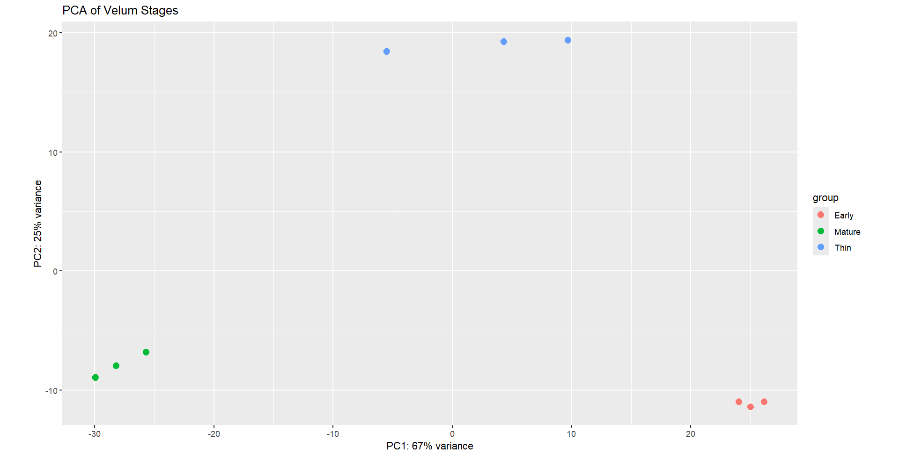
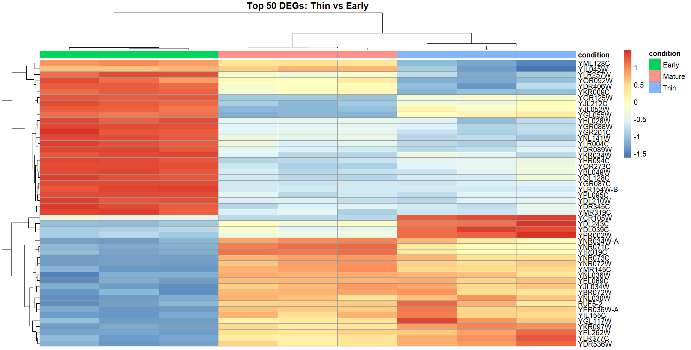
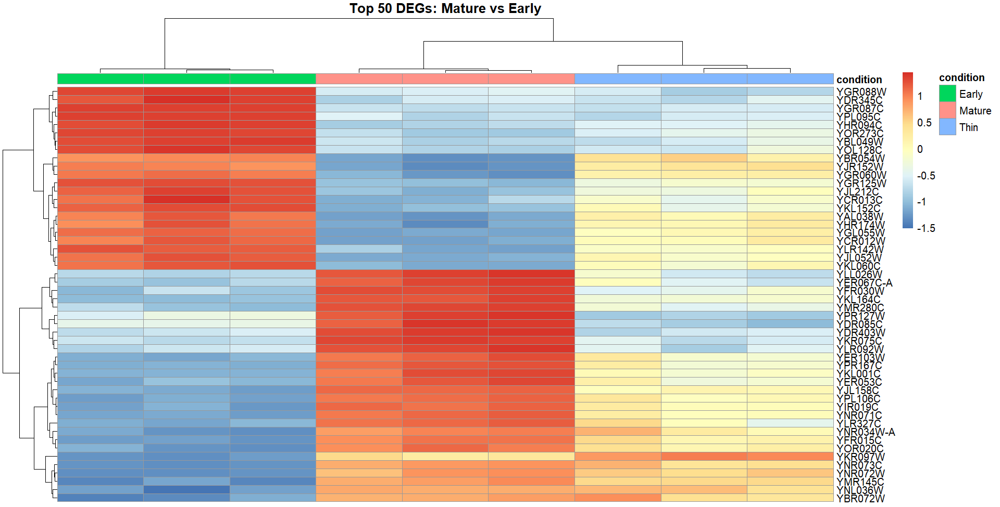
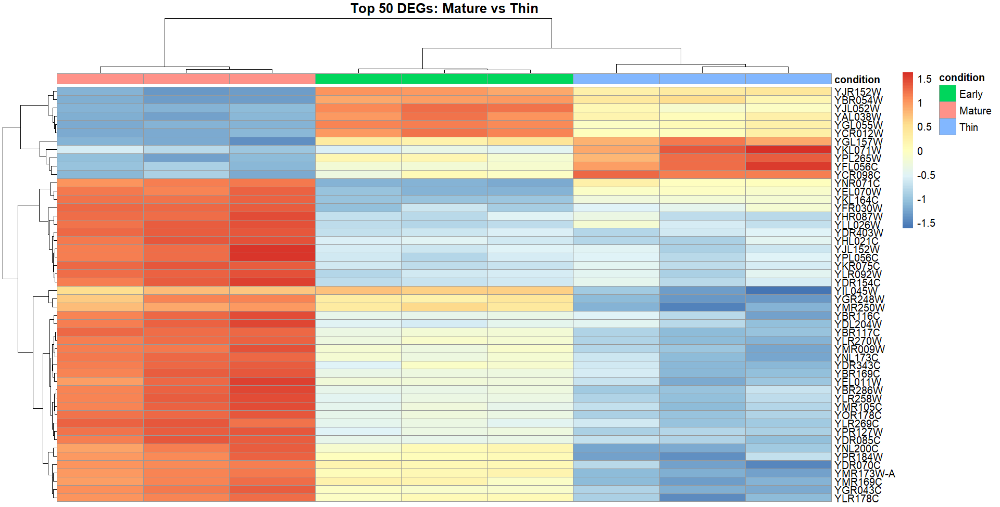
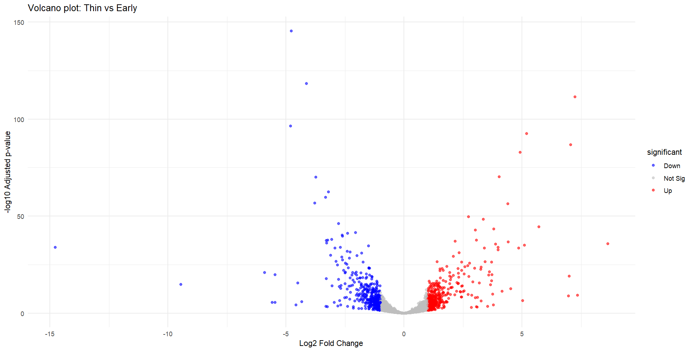
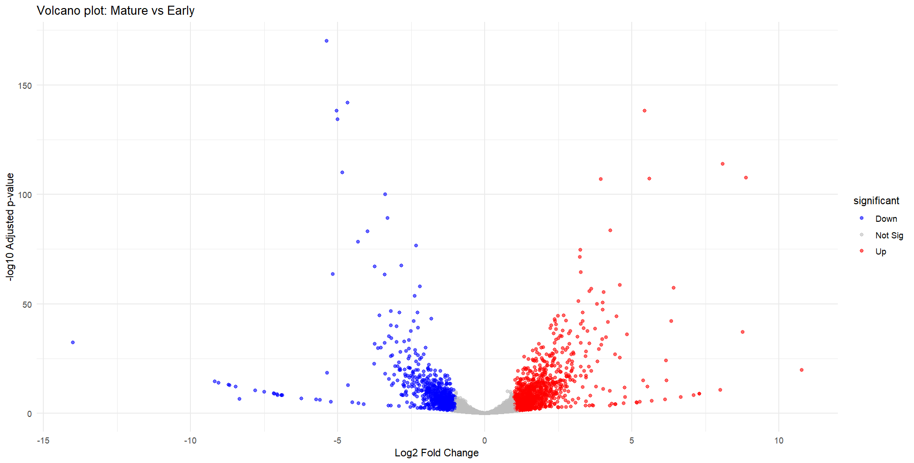
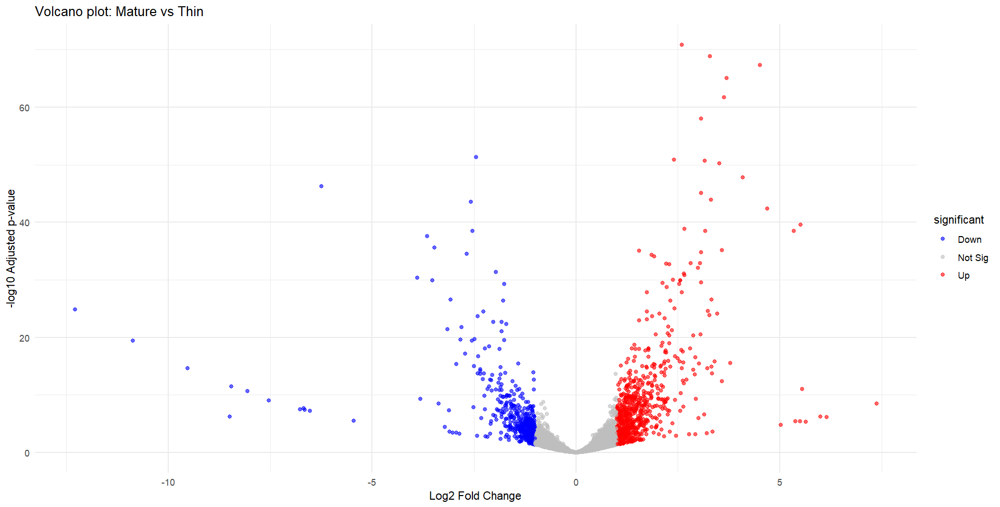
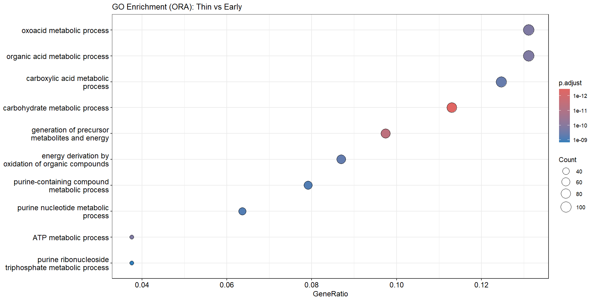
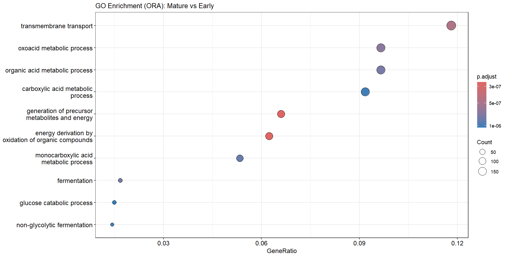
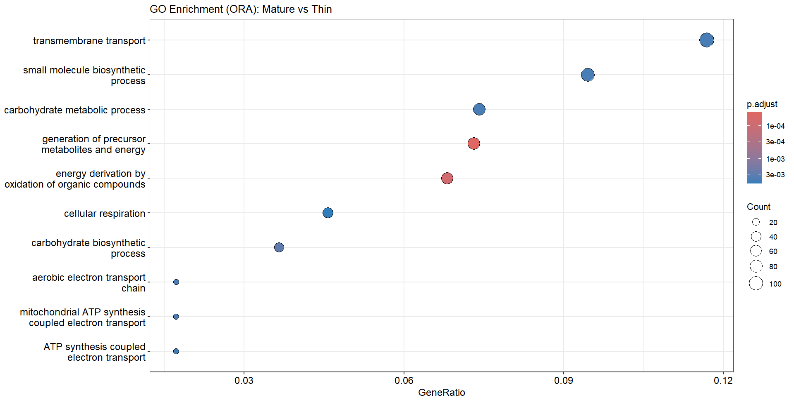

# Yeast transcriptomic analysis
## General Overview


## Table of Contents
- [Introduction](#introduction)
- [Methods](#methods)
  - [1. Data Description](#1-data-description)
  - [2. Quality Control](#2-quality-control)
  - [3. Quantification](#3-quantification)
  - [4. Differential Expression](#4-differential-expression)
  - [5. Visualization & Functional Annotation](#5-visualization-&-functional-annotation)
- [Results](#results)
- [Discussion](#discussion)
- [References](#references)

## Introduction
Flor yeast _Saccharomyces cerevisiae_ is widely used in fermentation industries, particularly in the production of sherry-type wines. During biological ageing, specific flor strains transition from planktonic (free-living, suspended) growth to form a floating biofilm known as velum on the surface of fermented liquid. Velum develops under harsh conditions, including high acetaldehyde concentrations, oxidative stress from metabolizing non-fermentable carbon sources, ethanol exposure, and water stress. These environmental pressures require adaptive responses that alter cell morphology, surface hydrophobicity, and metabolic activity [^1]. Prolonged stress may also lead to genomic variation, such as single nucleotide polymorphisms (SNPs), insertions and deletions (InDels), and chromosomal rearrangements, which can influence regulatory pathways and ultimately affect gene expression patterns [^2]. Characterizing transcriptional changes (transcriptional reprogramming) across different stages of velum development is therefore essential for understanding how flor yeast adapts to winemaking environments. This knowledge may help clarify the functions of previously uncharacterized genes, improve sherry wine production, and identify targets for strain optimization [^2].

Thus, comparative transcriptome analysis using bulk RNA sequencing (RNA-seq) provides a genome-wide method for quantifying gene expression changes across biological conditions. Initial data quality assessment can be performed using tools such as FastQC and MultiQC to detect sequencing errors, GC bias, or contamination [^3][^4]. Because excessive trimming may introduce bias in pseudo-alignment methods, trimming is generally recommended only when necessary [^5].

For transcript quantification, pseudo-alignment tools such as Salmon are commonly used due to their speed and computational efficiency. Salmon is used for quantification because its quasi-mapping approach skips mismatched bases, removing the need for trimming. It is faster and more accurate than comparable tools such as kallisto and eXpress, and handles both alignment and quantification in a single step. Salmon also corrects for technical errors introduced during library preparation, leading to more reliable estimates of gene activity in yeast metabolic studies [^6]. However, it is important to note that Salmon can show decreased accuracy for very short or lowly expressed transcripts, where limited sequence data makes reliable quantification more difficult [^8].

For statistical comparison across biofilm stages, DESeq2 is widely applied due to its ability to model count data using a negative binomial distribution and stabilize dispersion estimates through empirical Bayes shrinkage. It performs well with small sample sizes and controls the false discovery rate (FDR), making it suitable for multi-group transcriptomic comparisons [^8]. Although it does not easily accommodate complex mixed-effect models, it remains a robust and validated choice for standard differential expression analysis.

To interpret differentially expressed genes, functional enrichment tools such as clusterProfiler can be applied. Given the well-annotated genome of _S. cerevisiae_, approaches such as Over-Representation Analysis (ORA) allow for the identification of enriched biological processes involved in ethanol metabolism, oxidative stress response, and cell wall remodeling. ClusterProfiler improves interpretability by reducing redundancy among enriched Gene Ontology terms [^9]. However, its results are dependent on the quality and completeness of existing annotations, and very small or sparse gene lists may reduce statistical power and biological interpretability.

Overall, the objective of this study is to perform differential expression analysis and functional annotation across three stages of velum development, each with three biological replicates, in order to characterize the transcriptional programs underlying yeast biofilm formation during wine ageing.


## Methods
### 1. Data Description
The dataset was obtained from the NCBI BioProject PRJNA592304 and includes three biological replicates for each developmental stage: early biofilm, thin biofilm, and mature biofilm. Transcript quantification with Salmon required a reference transcriptome (cDNA), which was retrieved from Ensembl along with the corresponding GTF annotation file. Initial quantification performed using only protein-coding cDNA sequences resulted in a suboptimal mapping rate of approximately 41%, whereas expected mapping rates are typically around 80–90% [^12]. In yeast, the transcriptome annotation includes both coding (cDNA) and non-coding RNA (ncRNA) sequences [^13]. Therefore, to improve mapping sensitivity and overall alignment performance, the reference was expanded to include ncRNA sequences in addition to cDNA.

### 2. Quality Control
Quality control of the raw sequencing reads was performed in Ubuntu using FastQC (v0.12.1), which generates HTML reports summarizing key metrics such as per-base sequence quality, GC content, adapter contamination, and sequence duplication levels. FastQC is widely used in RNA-seq workflows to identify potential technical issues prior to downstream analyses [^3]. 

```
fastqc *.fastq.gz
```

To facilitate simultaneous inspection of all samples, MultiQC (v1.25.1) was used to aggregate individual FastQC reports into a single consolidated summary file, enabling efficient cross-sample comparison.

```
multiqc .
```

### 3. Quantification
Salmon (v1.10.3) requires two main steps: indexing the reference transcriptome and quantifying each sample. 

First, the _Saccharomyces cerevisiae_ cDNA and ncRNA reference files were combined to ensure quantification against the complete transcriptome, as yeast transcriptomes include both coding and non-coding RNA [^13].
```
zcat Saccharomyces_cerevisiae.R64-1-1.cdna.all.fa.gz Saccharomyces_cerevisiae.R64-1-1.ncrna.fa.gz > yeast_transcriptome_combined.fa
```

Next, the combined transcriptome was indexed. The `-t` parameter specifies the transcript FASTA file, and `-i` defines the name of the index directory. While Salmon’s default k-mer size is 31 (optimized for reads ≥75 bp), this was reduced to 21 because the reads in this dataset are 50 bp long [^7]. Using a smaller k-mer improves sensitivity for shorter reads.
```
salmon index -t yeast_transcriptome_combined.fa -i combined_index -k 21
```

Before quantifying all samples, a preliminary test run was performed on a single file to confirm successful indexing and assess the mapping rate. The `-l A` parameter allows Salmon to automatically detect library type (stranded or unstranded), `-r` specifies single-end reads, and `--validateMappings` enables selective alignment, which improves accuracy.
```
salmon quant -i combined_index \
             -l A \
             -r SRR10551657.fastq.gz \
             --validateMappings \
             -o test_boost_quant

# Check mapping rate
grep "Mapping rate" test_boost_quant/logs/salmon_quant.log
```
Once the preliminary test was complete, all nine samples were quantified through a loop script. 

Finally, before proceeding to differential expression analysis, a sanity check was performed to confirm successful quantification. For yeast RNA-seq datasets, mapping rates are typically expected to fall between 80–90% [^12].
```
grep "Mapping rate" quants/*_quant/logs/salmon_quant.log
```
 

### 4. Differential Expression
To initiate differential expression analysis, all nine Salmon quantification files were imported into R (v4.5.2) using tximport (v1.38.2). A transcript-to-gene mapping table (tx2gene) was created from the GTF file to aggregate transcript-level abundances to the gene level. Prior to analysis, a sanity check was performed to ensure that transcript IDs in the Salmon output were perfectly cross referenced with the mapping table.

In addition, metadata was created to specify the three experimental conditions (Early, Thin, and Mature biofilm), enabling proper model specification in DESeq2 (v1.50.2) [^11]. Given that yeast biofilm development occurs over distinct physiological stages, pairwise contrasts were prioritized over a continuous time-course model to identify stage-specific molecular shifts. Therefore, differential expression was assessed using a design formula of `~condition`.

Lastly, effect sizes were quantified as log2 fold changes (LFC), providing a symmetric and interpretable measure of differential expression. To improve the stability of LFC estimates and mitigate noise in low-count genes, shrinkage was applied using the adaptive shrinkage (ashr) method [^11]. This approach provided a more conservative measure of differential expression by moderating high-variance effects while preserving large, well-supported biological signals.


### 5. Visualization & Functional Annotation
To assess the overall structure of the transcriptomic data, Principal Component Analysis (PCA) was performed. Counts were transformed using the Variance Stabilizing Transformation (VST) function in DESeq2 to stabilize the mean–variance relationship across the dynamic range of expression [^11]. The argument `blind = FALSE` was specified to incorporate experimental design information during dispersion estimation, ensuring that variance stabilization accounted for biological condition differences.

Moreover, to visualize expression patterns of the most significantly transition-associated genes, heatmaps of the top 50 differentially expressed genes (ranked by Benjamini–Hochberg (BH) adjusted p-value) were generated for each pairwise contrast. VST-transformed counts were Z-score normalized to center each gene’s expression by its mean and standard deviation across samples [^14]. This scaling emphasizes relative up- or downregulation across the Early, Thin, and Mature biofilm stages rather than absolute expression differences. Heatmaps were generated using the pheatmap package (v1.0.12).

Volcano plots were generated using ggplot2 (v4.0.2) to visualize the global distribution of differentially expressed genes (DEGs). The x-axis represents shrunken log₂ fold change estimates, while the y-axis represents statistical significance as −log10 adjusted p-value (BH-corrected). Genes with `padj < 0.05` were considered significant. To mitigate overplotting among approximately 6,000 yeast transcripts, an alpha transparency of `0.6` was applied. In addition to this, a function was created to count the total number of genes that are upregulated or down regulated. 

Furthermore, to identify biological processes associated with biofilm development, Gene Ontology (GO) enrichment analysis was performed using Over-Representation Analysis (ORA). Significant DEGs from each comparison `(padj < 0.05 and |log₂FC| > 1)` were tested for enrichment in the Biological Process (BP) ontology using the clusterProfiler package (v4.18.4). Functional annotations were obtained from the yeast-specific org.Sc.sgd.db database (v3.22.0). Multiple testing correction was performed using the Benjamini–Hochberg method, with significance defined at `padj < 0.05`. Results were visualized as dotplots, where the gene ratio represents the proportion of DEGs annotated to a given GO term relative to the total genes within that term.

To further characterize stage-specific functional transitions, representative Biological Process terms were selected from each contrast: “oxoacid metabolic process” (Thin vs. Early), “transmembrane transport” (Mature vs. Early), and “small molecule biosynthetic process” (Mature vs. Thin). From each enriched term, a primary contributing gene was selected for downstream expression analysis. Systematic ORF identifiers were mapped to gene symbols using AnnotationDbi and the org.Sc.sgd.db database. Variance-stabilized expression values for these representative genes were extracted and reshaped into long format for visualization. Expression trajectories were plotted chronologically across the Early, Thin, and Mature stages using ggplot2 (v3.5.1), with individual biological replicates (n = 3 per stage) displayed separately. This approach enabled visualization of both overall stage-dependent trends and replicate-level consistency in the transcriptional drivers of yeast biofilm maturation.


## Results
### 1. Quality Control
An initial assessment of the raw sequencing data confirmed high library quality across all nine samples. The mean Phred quality scores were consistently maintained at 30 or above, indicating a base-calling accuracy of 99.9% and negating the need for further quality trimming. The GC content distribution followed a consistent, bell-shaped profile across all libraries, peaking at approximately 42%, which is characteristic of the _Saccharomyces cerevisiae_ genome [^15].

Analysis of sequence duplication levels revealed a stable distribution, with the percentage of the library plateauing at roughly 25% for sequences with a duplication level exceeding 1,000. Furthermore, adapter contamination was negligible, with levels ranging between 0–1% across the samples. Given that adapter content remained below the threshold for interference with downstream mapping, the sequences were utilized for quantification without additional trimming or filtering.


### 2. Quantification
Initial quantification against the standard S288C cDNA transcriptome yielded a mapping rate of ~41%. However, expanding the reference index to include non-coding RNAs (ncRNA) increased the mapping rate to 89.5%-92%. This indicates that a significant portion of the transcriptome in these flor yeast biofilm stages consists of non-coding elements, which were successfully captured using the expanded index and a k-mer size of k=21.

#### Table 1. Mapping rates for all RNA-seq samples following Salmon quantification
| Sample Name | Mapping Rate (%) |
|---|---|
| SRR10551657_Mature | 89.5 |
| SRR10551658_Mature | 88.7 |
| SRR10551659_Mature | 89.4 |
| SRR10551660_Thin | 91.5 |
| SRR10551661_Thin | 89.8 |
| SRR10551662_Thin | 96.2 |
| SRR10551663_Early | 92.5 |
| SRR10551664_Early | 92.0 |
| SRR10551665_Early | 92.8 |

#### Table 2. Summary of differentially expressed genes (DEGs) across biofilm stage comparisons
| Pairwise Stage | Total Genes | Upregulated | Downregulated |
|---|---|---|---|
| Thin vs Early | 839 | 419 | 420 |
| Mature vs Early | 1883 | 1043 | 840 |
| Mature vs Thin | 1127 | 661 | 466 |

Differential expression analysis (adjusted p-value < 0.05, |log₂FC| > 1) revealed stage-specific transcriptional changes. Thin vs Early had 839 DEGs (419 up, 420 down), reflecting balanced activation and repression as biofilm formation begins. Mature vs Early showed 1,883 DEGs (1,043 up, 840 down), indicating extensive transcriptional reprogramming during maturation. Mature vs Thin included 1,127 DEGs (661 up, 466 down), suggesting that the core biofilm program is largely established by the Thin stage, with the Mature stage mainly refining gene expression. Overall, the greatest transcriptional shifts occur between Early and Mature stages.

### 3. Differential Expression



**Figure 1:** Principal Component Analysis (PCA) of variance-stabilized transcript counts across biofilm stages

[Figure 1](results/PCA.jpeg) shows the principal component analysis (PCA) of variance-stabilized counts across the three biofilm stages. Principal component 1 (PC1) explains 67% of the total variance and clearly separates the Early stage from the Mature stage, indicating that chronological biofilm progression is the dominant source of transcriptomic variation. Principal component 2 (PC2), accounting for 25% of the variance, separates the Thin stage from both Early and Mature samples.

Together, PC1 and PC2 explain 92% of the total variance, demonstrating strong stage-specific structure in the dataset. The replicates cluster tightly within each condition, indicating high reproducibility and minimal technical variability. Notably, the Thin stage forms its own cluster rather than positioning midway between Early and Mature, suggesting that it represents a distinct transitional transcriptional state rather than a simple intermediate.


**Figure 2:** Heatmap of top 50 differentially expressed genes (DEGs) for Thin vs Early

Heatmaps of the top 50 differentially expressed genes (DEGs) for each pairwise comparison are shown in Figures 2–4.

[Figure 2](results/heatmap_tve.jpeg) (Thin vs Early) shows widespread transcriptional changes as the biofilm begins transitioning from initial attachment. Many genes highly expressed in Early are downregulated in Thin, while a subset becomes upregulated, indicating activation of biofilm-associated pathways.


**Figure 3:** Heatmap of top 50 DEGs for Mature vs Early

[Figure 3](results/heatmap_mve.jpeg) (Mature vs Early) demonstrates a broader transcriptional reprogramming. Genes tend to segregate into Early-specific and Mature-specific expression patterns, revealing major shifts in gene expression as the biofilm matures.


**Figure 4:** Heatmap of top 50 DEGs for Mature vs Thin

[Figure 4](results/heatmap_mvt.jpeg) (Mature vs Thin) reveals fewer dramatic shifts compared to comparisons involving Early, suggesting that many core biofilm programs are already established during the Thin stage and are refined during maturation. There are a few genes that are still in the early stage, indicating they’re late to maturation.

Overall, the heatmaps demonstrate stage-specific transcriptional programs and coordinated gene regulation during biofilm development.


**Figure 5:** Volcano plot of differential expression for Thin vs Early

Volcano plots were generated to visualize the relationship between effect size (log₂ fold change) and statistical significance (−log₁₀ adjusted p-value) for each comparison (Figures 5–7).

[Figure 5](results/volcano_tve.jpeg) (Thin vs Early) shows substantial downregulation of Early-stage genes and activation of Thin-stage genes, reflecting a rapid transcriptional shift as cells initiate biofilm formation. It exhibited large effect sizes, with log₂ fold changes ranging from approximately −14 to +7. The most statistically significant gene reached −log₁₀(padj) ≈ 150, indicating extremely strong evidence of differential expression. The majority of upregulated genes fell within |log₂FC| between 0.5 and 5, consistent with coordinated transcriptional remodeling during early biofilm formation.



**Figure 6:** Volcano plot of differential expression for Mature vs Early

Moreover, [Figure 6](results/volcano_mve.jpeg) (Mature vs Early) displays the most extensive transcriptional divergence, with large log₂ fold changes in both directions, ranging from -14 to +11. Some genes exceed |log₂FC| of 5, corresponding to ≥32-fold expression differences, demonstrating large-scale transcriptomic reprogramming during maturation. Several genes exceeded −log₁₀(padj) of 150, reflecting extremely strong statistical support. The broad horizontal dispersion across the log₂ fold change axis indicates that biofilm maturation involves extensive transcriptional reprogramming, with substantial numbers of genes both upregulated and downregulated.


**Figure 7:** Volcano plot of differential expression for Mature vs Thin

[Figure 7](results/volcano_mvt.jpeg) (Mature vs Thin) shows significant differences but generally smaller effect sizes compared to Mature vs Early. This suggests that the Thin stage already establishes much of the biofilm transcriptional program, with the Mature stage fine-tuning specific gene sets rather than initiating a second large-scale shift. More genes are upregulated than downregulated, with log₂ fold changes ranging from approximately −14 to +6. However, fewer genes reached extreme −log₁₀(padj) values compared to contrasts involving Early, suggesting that while effect sizes may be large for specific transcripts, the overall magnitude of global reprogramming is reduced relative to the Early transitions. 

Overall, the volcano plots indicate that the largest transcriptomic transition occurs between Early and biofilm-associated stages.


**Figure 8:** Gene Ontology (GO) enrichment analysis for Thin vs Early

Over-representation analysis (ORA) was performed to identify enriched Gene Ontology (GO) biological processes among DEGs (Figures 8–10). The gene ratio represents the proportion of input DEGs annotated to a given GO term relative to the total number of DEGs tested. Larger gene ratios indicate that a greater fraction of differentially expressed genes are associated with that biological process, strengthening the functional relevance of the enrichment result. 

[Figure 8](results/GO_tve.jpeg) (Thin vs Early) shows significant enrichment of metabolic processes, including oxoacid metabolic process and organic acid metabolic process (adjusted p-value = 1×10⁻¹⁰; gene count = 100; gene ratio ≈ 0.13). In addition, carbohydrate metabolic process and generation of precursor metabolites and energy display even stronger statistical significance (adjusted p-value = 1×10⁻¹²; gene count = 80; gene ratio ≈ 0.09 - 0.11). The high gene counts combined with extremely low adjusted p-values indicate robust metabolic restructuring as cells transition from planktonic growth to early biofilm formation.


**Figure 9:** GO enrichment analysis for Mature vs Early

In addition, [Figure 9](results/GO_mve.jpeg) (Mature vs Early) shows significant enrichment of metabolic pathways. Notably, transmembrane transport is highly enriched (adjusted p-value = 5×10⁻⁷; gene count = 150; gene ratio ≈ 0.12), indicating increased transport activity during biofilm maturation. Although generation of precursor metabolites and energy and energy derivation by oxidation of organic compounds exhibit slightly lower adjusted p-values (3×10⁻⁷), transmembrane transport involves the largest number of differentially expressed genes, suggesting that membrane transport processes play a central role in the mature biofilm state.


**Figure 10:** GO enrichment analysis for Mature vs Thin

Lastly, [Figure 10](results/GO_mvt.jpeg) (Mature vs Thin) highlights transmembrane transport and small molecule biosynthetic process as key enriched pathways (adjusted p-value = 3×10⁻³; gene ratio ≈ 0.12; gene count ≈ 100). Although statistically significant, these adjusted p-values are less extreme than those observed in comparisons involving the Early stage, suggesting that maturation reflects refinement of nutrient exchange and biosynthetic capacity rather than large-scale metabolic restructuring.

In contrast, generation of precursor metabolites and energy and energy derivation by oxidation of organic compounds exhibit stronger statistical support (adjusted p-value = 1×10⁻⁴; gene count ≈ 40; gene ratio ≈ 0.07–0.08). Despite involving fewer genes, the lower adjusted p-values indicate that energy production pathways remain significantly regulated during the transition from Thin to Mature biofilm.


## Discussion
### 1. 


## References
[^1]: Bakker, J. (2013). Flor Yeasts. ScienceDirect. https://www.sciencedirect.com/topics/agricultural-and-biological-sciences/flor-yeasts
[^2]: Mardanov, A. V., Eldarov, M. A., Beletsky, A. V., Tanashchuk, T. N., Kishkovskaya, S. A., & Ravin, N. V. (2020). Transcriptome profile of yeast strain used for biological wine aging revealed dynamic changes of gene expression in course of flor development. Frontiers in Microbiology, 11, 538. https://doi.org/10.3389/fmicb.2020.00538
[^3]: Babraham Bioinformatics - FastQC A Quality Control tool for High Throughput Sequence Data. (n.d.). https://www.bioinformatics.babraham.ac.uk/projects/fastqc/
[^4]: Ewels, P., Magnusson, M., Lundin, S., & Käller, M. (2016). MultiQC: summarize analysis results for multiple tools and samples in a single report. Bioinformatics, 32(19), 3047–3048. https://doi.org/10.1093/bioinformatics/btw354
[^5]: Williams, C. R., Baccarella, A., Parrish, J. Z., & Kim, C. C. (2016b). Trimming of sequence reads alters RNA-Seq gene expression estimates. BMC Bioinformatics, 17(1), 103. https://doi.org/10.1186/s12859-016-0956-2
[^6]: Patro, R., Duggal, G., Love, M. I., Irizarry, R. A., & Kingsford, C. (2017). Salmon provides fast and bias-aware quantification of transcript expression. Nature Methods, 14(4), 417–419. https://doi.org/10.1038/nmeth.4197
[^7]: Wu, D. C., Yao, J., Ho, K. S., Lambowitz, A. M., & Wilke, C. O. (2018). Limitations of alignment-free tools in total RNA-seq quantification. BMC Genomics, 19(1), 510. https://doi.org/10.1186/s12864-018-4869-5
[^8]: Wang, T., Li, B., Nelson, C. E., & Nabavi, S. (2019). Comparative analysis of differential gene expression analysis tools for single-cell RNA sequencing data. BMC Bioinformatics, 20(1), 40. https://doi.org/10.1186/s12859-019-2599-6
[^9]: De Oliveira, F. H. S., Gomes, F. A., & Feltes, B. C. (2026). Benchmarking multiple gene ontology enrichment tools reveals high biological significance, ranking, and stringency heterogeneity among datasets. Frontiers in Bioinformatics, 6. https://doi.org/10.3389/fbinf.2026.1755664
[^10]: Mistry, M. P. a. M. (2017, August 21). Quantitation of transcript abundance using Salmon. Introduction to RNA-seq using high performance computing (Orchestra) - ARCHIVED. https://hbctraining.github.io/Intro-to-rnaseq-hpc-orchestra/lessons/09_salmon.html
[^11]: I Love, M., Anders, S., & Huber, W. (2025, December 1). Analyzing RNA-seq data with DESEQ2. Bioconductor. https://bioconductor.org/packages/devel/bioc/vignettes/DESeq2/inst/doc/DESeq2.html#differential-expression-analysis
[^12]: Lu, Z., & Lin, Z. (2019). Pervasive and dynamic transcription initiation in Saccharomyces cerevisiae. Genome Research, 29(7), 1198–1210. https://doi.org/10.1101/gr.245456.118
[^13]: Jiang, Z., Zhou, X., Li, R., Michal, J. J., Zhang, S., Dodson, M. V., Zhang, Z., & Harland, R. M. (2015). Whole transcriptome analysis with sequencing: methods, challenges and potential solutions. Cellular and Molecular Life Sciences, 72(18), 3425–3439. https://doi.org/10.1007/s00018-015-1934-y
[^14]: Lancelle, L. J., Potru, P. S., Spittau, B., & Wiemann, S. (2025). DgeaHeatmap: an R package for transcriptomic analysis and heatmap generation. Bioinformatics Advances. https://pmc.ncbi.nlm.nih.gov/articles/PMC12401572/
[^15]: Lynch, D. B., Logue, M. E., Butler, G., & Wolfe, K. H. (2010). Chromosomal G + C Content Evolution in yeasts: Systematic interspecies differences, and GC-Poor troughs at Centromeres. Genome Biology and Evolution, 2, 572–583. https://doi.org/10.1093/gbe/evq042
[^16]: Alexandre, H. (2013, October 15). Flor yeasts of Saccharomyces cerevisiae—Their ecology, genetics and metabolism. ScienceDirect. https://www.sciencedirect.com/science/article/abs/pii/S0168160513004078
[^17]: Mardanov, A. V., Eldarov, M. A., Beletsky, A. V., Tanashchuk, T. N., Kishkovskaya, S. A., & Ravin, N. V. (2020b). Transcriptome profile of yeast strain used for biological wine aging revealed dynamic changes of gene expression in course of flor development. Frontiers in Microbiology, 11, 538. https://doi.org/10.3389/fmicb.2020.00538
[^18]: David-Vaizant, V., & Alexandre, H. (2018). Flor yeast diversity and dynamics in biologically aged wines. Frontiers in Microbiology, 9, 2235. https://doi.org/10.3389/fmicb.2018.02235
[^19]: Zara, S., Gross, M. K., Zara, G., Budroni, M., & Bakalinsky, A. T. (2010). Ethanol-Independent Biofilm Formation by a Flor Wine Yeast Strain ofSaccharomyces cerevisiae. Applied and Environmental Microbiology, 76(12), 4089–4091. https://doi.org/10.1128/aem.00111-10
[^20]: Váchová, L., Čáp, M., & Palková, Z. (2012). Yeast Colonies: A model for studies of aging, environmental adaptation, and Longevity. Oxidative Medicine and Cellular Longevity, 2012, 1–8. https://doi.org/10.1155/2012/601836
[^21]: Caron-Godon, C. A., Collington, E., Wolf, J. L., Coletta, G., & Glerum, D. M. (2024). More than Just Bread and Wine: Using Yeast to Understand Inherited Cytochrome Oxidase Deficiencies in Humans. International Journal of Molecular Sciences, 25(7), 3814. https://doi.org/10.3390/ijms25073814
[^22]: Baumann, L., Doughty, T., Siewers, V., Nielsen, J., Boles, E., & Oreb, M. (2021). Transcriptomic response of Saccharomyces cerevisiae to octanoic acid production. FEMS Yeast Research, 21(2). https://doi.org/10.1093/femsyr/foab011
[^23]: Pisithkul, T., Schroeder, J. W., Trujillo, E. A., Yeesin, P., Stevenson, D. M., Chaiamarit, T., Coon, J. J., Wang, J. D., & Amador-Noguez, D. (2019). Metabolic Remodeling during Biofilm Development of Bacillus subtilis. mBio, 10(3). https://doi.org/10.1128/mbio.00623-19
[^24]: Yi, H., Ahn, Y., Song, G. C., Ghim, S., Lee, S., Lee, G., & Ryu, C. (2016). Impact of a Bacterial Volatile 2,3-Butanediol on Bacillus subtilis Rhizosphere Robustness. Frontiers in Microbiology, 7, 993. https://doi.org/10.3389/fmicb.2016.00993
[^25]: GonzáLez, E., FernáNdez, M. R., Marco, D., Calam, E., Sumoy, L., ParéS, X., Dequin, S., & Biosca, J. A. (2009). Role of Saccharomyces cerevisiae Oxidoreductases Bdh1p and Ara1p in the Metabolism of Acetoin and 2,3-Butanediol. Applied and Environmental Microbiology, 76(3), 670–679. https://doi.org/10.1128/aem.01521-09
